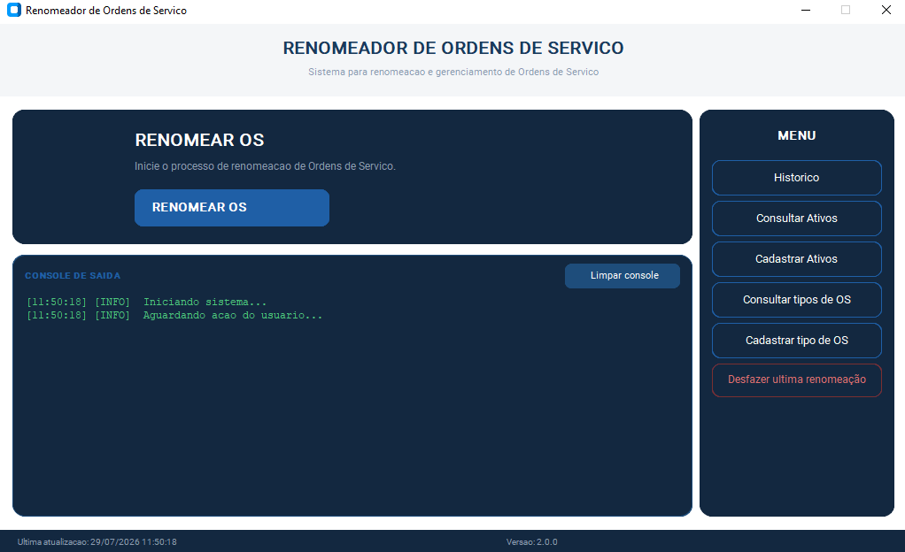
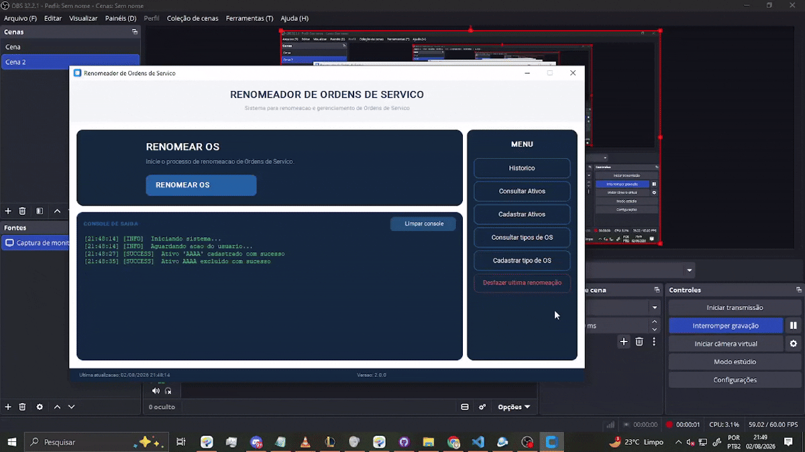

# Renomeador de OS

Sistema desktop para **renomeação e organização automática de Ordens de Serviço (OS)** em formato PDF, com base em regras configuráveis de código, ativo e tipo de OS.

O sistema nasceu da necessidade de padronizar o tratamento de arquivos PDF baixados de sistemas externos: identificá-los por um código numérico, associá-los a um ativo e a um tipo de OS, renomeá-los seguindo um padrão consistente e organizá-los automaticamente em pastas. Foi projetado para ser **genérico e reconfigurável**, podendo ser adaptado a diferentes contextos e organizações apenas por meio de cadastros internos, sem alteração de código.

---

## Capturas de tela e vídeos

### Tela principal



*Tela inicial: início da renomeação, console de saída em tempo real e menu lateral com acesso a histórico, consultas e cadastros.*

### Vídeo demonstrativo — renomeação


---

## Índice

- [Capturas de tela e vídeos](#capturas-de-tela-e-vídeos)
- [Como funciona](#como-funciona)
- [Padrões de renomeação](#padrões-de-renomeação)
- [Organização automática de pastas](#organização-automática-de-pastas)
- [Funcionalidades do menu](#funcionalidades-do-menu)
- [Guia de uso: cadastrar tipo de OS e ativos](#guia-de-uso-cadastrar-tipo-de-os-e-ativos)
- [Instalação (usuário final)](#instalação-usuário-final)
- [Ambiente de demonstração / avaliação](#ambiente-de-demonstração--avaliação)
- [Ambiente de desenvolvimento](#ambiente-de-desenvolvimento)
- [Gerando o executável e o instalador](#gerando-o-executável-e-o-instalador)
- [Histórico de versões](#histórico-de-versões)
- [Licença](#licença)

---

## Como funciona

1. O usuário seleciona o(s) arquivo(s) PDF a serem processados.
2. O sistema procura, via regex, um **código numérico de 8 dígitos consecutivos** no conteúdo/nome do arquivo — este código representa o número da OS.
3. O sistema consulta duas tabelas cadastradas em um banco **SQLite** local:
   - **Ativos**: nomes/códigos de ativos previamente cadastrados. A busca aceita variações com dígitos e separadores adicionais (ex.: `ATIVO-01-VR`), permitindo reconhecer o ativo mesmo com pequenas diferenças de escrita.
   - **Tipos de OS**: categorias de serviço previamente cadastradas (ex.: corretiva, preventiva, requisição, etc.).
4. Com base no que for encontrado (código, ativo e/ou tipo de OS), o sistema monta o novo nome do arquivo seguindo um padrão fixo.
5. O arquivo é renomeado e, em seguida, movido automaticamente para a pasta correspondente ao seu tipo de OS, criando a pasta caso ela ainda não exista.

## Padrões de renomeação

A lógica de renomeação combina até três elementos — **código**, **tipo de OS** e **ativo** — resultando em quatro padrões possíveis:

| Elementos encontrados | Padrão de saída |
|---|---|
| Código + Tipo de OS + Ativo | `OS 88888888 REQUISIÇÃO - ATIVO-01` |
| Código + Ativo | `OS 88888888 ATIVO-01` |
| Código + Tipo de OS | `OS 88888888 REQUISIÇÃO` |
| Somente código | `OS 88888888` |

> Caso apenas o **ativo** seja identificado (sem um tipo de OS explícito), o arquivo é tratado como uma **OS preventiva** por convenção do sistema.

## Organização automática de pastas

Após a renomeação, o arquivo é movido para a pasta referente ao seu tipo de OS:

- Se o tipo de OS for identificado, o arquivo vai para a pasta correspondente (criada automaticamente caso não exista).
- Se apenas o ativo for identificado, o arquivo é tratado como preventiva e movido para a pasta de preventivas.
- Se nem ativo nem tipo de OS forem identificados, o arquivo **permanece no local original**, aguardando tratamento manual.

## Funcionalidades do menu

- **Renomear OS** — inicia o fluxo principal de identificação e renomeação de arquivos.
- **Histórico** — consulta de renomeações já realizadas.
- **Consultar Ativos** — visualização dos ativos cadastrados.
- **Cadastrar Ativos** — inclusão de novos ativos na base.
- **Consultar tipos de OS** — visualização dos tipos de OS cadastrados.
- **Cadastrar tipo de OS** — inclusão de novos tipos de OS.
- **Desfazer última renomeação** — reverte a última operação de renomeação/movimentação de arquivo.
- **Console de saída** — exibe o log de execução em tempo real, com opção de limpar o console.

Todo o cadastro (ativos e tipos de OS) é armazenado em um banco **SQLite** local, o que permite personalizar o sistema para diferentes áreas ou empresas sem necessidade de alterar código.

## Guia de uso: cadastrar tipo de OS e ativos

Estas são as duas configurações que tornam o sistema adaptável a **qualquer empresa ou área de atuação**. O exemplo abaixo usa o cenário de uma **empresa de telecomunicações**, com o ativo `SWITCH`.

### Cadastrar tipo de OS

O **tipo de OS** representa a categoria/natureza do serviço executado (ex.: corretiva, preventiva, instalação, requisição). Ele é usado pelo sistema para:

- Identificar a categoria da OS a partir do conteúdo do PDF.
- Compor o novo nome do arquivo.
- Definir a pasta de destino para onde o arquivo será movido após a renomeação.

**Passo a passo:**

1. No menu lateral, acesse **Cadastrar tipo de OS**.
2. Informe o **nome/termo do tipo de OS** exatamente como ele aparece nos documentos (ex.: `MANUTENÇÃO CORRETIVA`, `MANUTENÇÃO PREVENTIVA`, `INSTALAÇÃO`, `REQUISIÇÃO`).
3. Associe, se aplicável, a **pasta de destino** para onde os arquivos desse tipo devem ser movidos.
4. Salve o cadastro. A partir deste momento, o sistema passa a reconhecer esse tipo de OS automaticamente nas próximas renomeações.



**Exemplo (telecomunicações):**

| Tipo de OS cadastrado | Uso |
|---|---|
| `INSTALAÇÃO` | Novas instalações de equipamentos em campo |
| `MANUTENÇÃO CORRETIVA` | Reparo de falhas em equipamentos já instalados |
| `MANUTENÇÃO PREVENTIVA` | Manutenções programadas |

### Cadastrar Ativos

O **ativo** representa o equipamento/item físico ao qual a OS se refere. O cadastro de um ativo não precisa cobrir todas as variações de escrita: o sistema reconhece o ativo mesmo quando o texto do PDF contém **dígitos extras ou separadores** (como `-`, espaços ou combinações do tipo `NOME - VARIAÇÃO`) junto ao nome cadastrado.

**Passo a passo:**

1. No menu lateral, acesse **Cadastrar Ativos**.
2. Informe o **nome-base do ativo**, sem variações (ex.: `SWITCH`).
3. Salve o cadastro.
4. A partir daí, o sistema reconhecerá esse ativo em qualquer documento cujo texto contenha o nome-base, mesmo com variações como identificadores de modelo, versão ou unidade.


Após cadastrados, os ativos podem ser conferidos na tela **Consultar Ativos**, que exibe o código do ativo e sua descrição:


*Exemplo: cada ativo é cadastrado com um código curto (ex.: `AP`) e uma descrição associada (ex.: `access point`), permitindo excluir cadastros diretamente pela tabela.*


**Exemplo (telecomunicações):**

Ao cadastrar o ativo `SWITCH`, o sistema passa a reconhecer no PDF variações como:

- `SWITCH`
- `SWITCH-V1`
- `SWITCH01`

Ou seja, o cadastro de um único termo-base (`SWITCH`) cobre toda a família de variações usada em campo pela equipe técnica, sem necessidade de cadastrar cada modelo/versão separadamente.

**Exemplo completo de renomeação (telecomunicações):**

Um PDF contendo o código `88888888`, o tipo de OS `INSTALAÇÃO` e o ativo `SWITCH-V1` seria renomeado para:

```
OS 88888888 INSTALAÇÃO - SWITCH-V1
```

E movido automaticamente para a pasta cadastrada para o tipo de OS `INSTALAÇÃO`.


## Ambiente de demonstração / avaliação

Para facilitar testes rápidos, o projeto disponibiliza os arquivos ja prontos e compilados para download. Após instalado, a pasta conterá dois executáveis principais: `main.exe`, sem nenhum dado pré-cadastrado, e `seed_demo.exe`, responsável por popular o banco local com dados genéricos (ativos e tipos de OS de exemplo). Para agilizar ainda mais os testes, um conjunto de PDFs fictícios já está disponível em [OS TESTE](./RenomeadorV2/demo/OS%20TESTE/), prontos para uso na renomeação — sem necessidade de configurar o sistema do zero.

**Passo a passo:**

1. Baixe a pasta [Renomeador de OS demo ](./RenomeadorV2/demo/Renomeador%20de%20OS&20demo/).
2. Na pasta, execute [seed_demo](./RenomeadorV2/demo/Renomeador%20de%20OS&20demo/seed_demo.exe) uma única vez para popular o banco com os dados de exemplo.
3. execute o arquivo [main](./RenomeadorV2/demo/Renomeador%20de%20OS&20demo/main.exe) — os dados de exemplo já estarão disponíveis.
4. Clique em **Renomear OS** e selecione os PDFs de teste disponíveis em [OS TESTE](./RenomeadorV2/demo/OS%20TESTE/) para ver o fluxo completo em ação.

> **Observação:** caso não se sinta confortável em executar um `.exe` já compilado, é possível configurar este mesmo ambinte a partir da seção  [Ambiente de desenvolvimento](#ambiente-de-desenvolvimento) e popular o banco ao rodar o arquivo 🔗 **[seed_demo.py](./renomeadorV2/seed_demo.py)** mas isso exige que o ambiente de desenvolvimento já esteja previamente instalado e que o script seja rodado a partir do diretorio aonde o projeto se encontra.


**Dados de exemplo:**
Um comando/script pré-cadastra a lista padrão de ativos e tipos de OS (ex.: `SWITCH`, `ROTEADOR`, `SERVIDOR`, `MANUTENÇÃO CORRETIVA`, `MANUTENÇÃO PREVENTIVA`, `REQUISIÇÃO`, entre outros) diretamente no banco SQLite local, permitindo testar a renomeação imediatamente.

**PDFs de teste:**
Um conjunto de Ordens de Serviço fictícias (dados e clientes inventados, sem qualquer vínculo com empresas reais) está disponível para testar os diferentes padrões de renomeação — preventiva, corretiva e requisição, cobrindo vários tipos de ativos.

🔗 [Abrir pasta OS TESTE](./RenomeadorV2/demo/OS%20TESTE/)

**Roteiro sugerido para teste:**
1. Instale o sistema e rode o script de dados de exemplo.
2. Abra o Renomeador de OS e clique em **Renomear OS**.
3. Selecione os PDFs de teste disponibilizados em 🔗 [OS TESTE](./RenomeadorV2/demo/OS%20TESTE/).
4. Confira no console de saída do programa resultado da renomeação e a movimentação dos arquivos para as pastas corretas após a abertura da mesma.


## Ambiente de desenvolvimento

### Pré-requisitos

- Python 3.13
- Dependências do projeto (ver `requirements.txt`), incluindo, entre outras:
- customtkinter==5.2.2 
- Pillow==11.3.0 
- PyInstaller==6.15.0 
- pyinstaller-hooks-contrib==2025.8
-  PyMuPDF==1.27.2.3 
- rarfile==4.2 
- regex==2026.1.15

### Passos

```bash
# Clonar o repositório
git clone <https://github.com/caioosantss/RenomeadorOS>
cd renomeador-os

# Criar e ativar ambiente virtual
python -m venv venv
venv\Scripts\activate      # Windows
source venv/bin/activate   # Linux/Mac

# Instalar dependências
pip install -r requirements.txt

# Executar a aplicação
python main.py
```

### Estrutura de pastas (resumo)

```
RENOMEADOROS/
├── renomeadorV1/
│   ├── renomeador.exe
│   └── renomeador.py
├── renomeadorV2/
|   ├──demo
|   |    ├──OS TESTE/
|   |    └─Renomeador de OS demo/
|   |       
│   ├── __pycache__/
│   ├── docs/
|   |    ├──exemplo_de_renomeacao.gif
|   |    ├──exemplo_de_salvar_ativos.gif
|   |    ├──exemplo_de_savar_tipo_os.gif
|   |    └──tela_principal.png
│   ├── database/
|   |   └──databse.db
|   |
│   ├── interface/
│   │   ├── __pycache__/
│   │   ├── __init__.py
│   │   ├── principal.py
│   │   └── servicos.py
│   ├── banco.py
│   ├── LeitorPDF.py
│   ├── main.py
│   ├── renomeador.py
│   ├── requirements.txt
│   └── seed_demo.py
├── .gitattributes
├── .gitignore
└── README.md
```

## Gerando o executável e o instalador

O processo de empacotamento tem duas etapas: primeiro o **PyInstaller** gera o executável a partir do código Python, depois o **Inno Setup** empacota esse executável em um instalador `.exe` para distribuição.

### 1. Gerar o executável com PyInstaller

```bash
python -m PyInstaller --noconfirm --onedir --windowed  --add-data "docs;docs" --add-data "interface;interface" --hidden-import="pymupdf" --hidden-import="fitz" --hidden-import="rarfile" main.py
```

Isso gera a pasta `dist/main/`, contendo o executável (`main.exe`) e todos os arquivos necessários para rodar a aplicação de forma independente (sem precisar de Python instalado na máquina do usuário).

> **Observação:** lembre-se de executar dentro da pasta renomeadorV2

### 2. Gerar o instalador com Inno Setup

*Instalando o Inno Setup:*

1. Baixe o instalador em [jrsoftware.org/isinfo.php](https://jrsoftware.org/isinfo.php) (versão gratuita).
2. Execute o instalador e siga o assistente até concluir — nenhuma configuração especial é necessária.

*Rodando o script:*

O arquivo setup.iss já está disponibilizado junto ao repositório. Para compilá-lo:

1. Certifique-se de que o setup.iss está salvo *na mesma pasta onde o PyInstaller gera o dist/*. Isso é essencial: o script busca os arquivos em dist\main\* relativo à própria localização dele; se for movido para outra pasta sem ajustar o caminho, a compilação não vai encontrar os arquivos do programa.
2. Abra o setup.iss com dois cliques (ele abre direto no Inno Setup Compiler).
3. Clique em *Build → Compile* (ou aperte Ctrl+F9).
4. O instalador final será gerado em Installer/, dentro da mesma pasta, com o nome Setup_RenomeadorOS_v2.0.0.exe.
>  **Alterando o ícone:** o ícone do instalador e dos atalhos vem do arquivo apontado em `SetupIconFile` (e também usado no comando do PyInstaller, com `--icon`). Para trocar o ícone da aplicação, **substitua o arquivo `.ico` referenciado em ambos os comandos** (PyInstaller e Inno Setup) por um novo arquivo `.ico` — não é possível apenas renomear um arquivo de imagem comum, ele precisa estar no formato `.ico`.


## Histórico de versões

**V1 (script inicial)**
Primeira versão, funcionando como script sem interface gráfica. Identificava o código de 8 dígitos, consultava ativos e tipos de OS, e suportava dois padrões de renomeação:
- `OS 99999999 ATIVO-10` (preventiva, quando só o ativo era encontrado)
- `OS 99999999 CORRETIVA`

**V2 (versão atual)**
Evolução criada para colocar a automação em produção, trazendo:
- Interface gráfica completa, com console de saída, histórico e telas de cadastro.
- Expansão da lógica de renomeação para quatro padrões possíveis (código, tipo de OS e ativo combinados).
- Empacotamento via PyInstaller e instalador via Inno Setup, facilitando a distribuição para múltiplos usuários.

*Versão atual: 2.0.0*

## Licença

Este projeto está licenciado sob os termos da **Licença MIT**. Veja o arquivo `LICENSE` para mais detalhes.

```
MIT License

Copyright (c) [ano] [nome do titular dos direitos]

Permission is hereby granted, free of charge, to any person obtaining a copy
of this software and associated documentation files (the "Software"), to deal
in the Software without restriction, including without limitation the rights
to use, copy, modify, merge, publish, distribute, sublicense, and/or sell
copies of the Software, and to permit persons to whom the Software is
furnished to do so, subject to the following conditions:

The above copyright notice and this permission notice shall be included in all
copies or substantial portions of the Software.

THE SOFTWARE IS PROVIDED "AS IS", WITHOUT WARRANTY OF ANY KIND, EXPRESS OR
IMPLIED, INCLUDING BUT NOT LIMITED TO THE WARRANTIES OF MERCHANTABILITY,
FITNESS FOR A PARTICULAR PURPOSE AND NONINFRINGEMENT. IN NO EVENT SHALL THE
AUTHORS OR COPYRIGHT HOLDERS BE LIABLE FOR ANY CLAIM, DAMAGES OR OTHER
LIABILITY, WHETHER IN AN ACTION OF CONTRACT, TORT OR OTHERWISE, ARISING FROM,
OUT OF OR IN CONNECTION WITH THE SOFTWARE OR THE USE OR OTHER DEALINGS IN THE
SOFTWARE.
```
